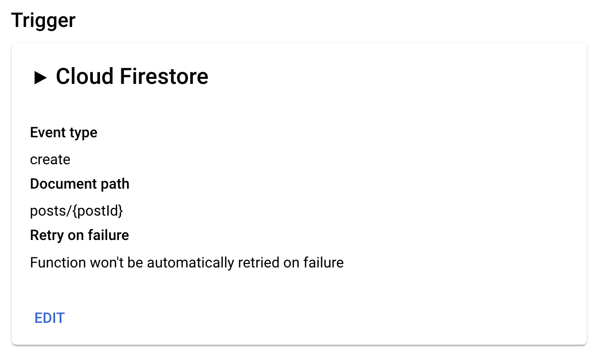
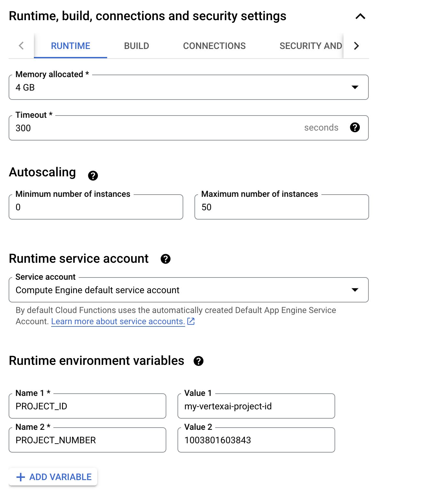
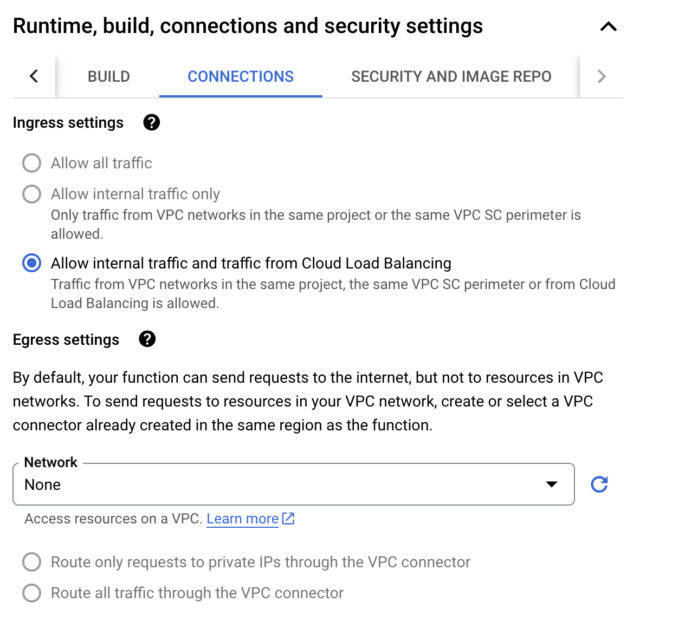

# Step By Step Instructions on getting your Python FastAPI server up and running

Pull this repository to your local machine and update your working directory in terminal to the project folder before running the below steps.

0. Configure environment variables, such as `PROJECT_ID` in `scripts/init.sh`. This script will be run by `scripts/dev.sh` and `scripts/deploy.sh` to initialise project variables
1. Create a new `venv` on in the project root folder to prevent dependency mismatch using the script `python -m venv .`
2. Activate virtual environment using `source bin/activate` from the project root folder
3. From within the virtual environment, install dependancies using `pip install -r requirements.txt`
4. Run `chmod +x ./scripts/dev.sh` to make the development script executable and then run `./scripts/dev.sh` to start the development server locally
5. Congrats! You have your FastAPI server running locally
6. Once you have added your own endpoints and tested the server locally, you can deploy it by running `chmod +x ./scripts/deploy.sh` and then `./scripts/deploy.sh` - this will deploy the server to Cloud Run in the project specified in step 0.

## Permissions needed for the Cloud Run service's service account during deployment

- `Cloud Build Service Account`
- `Cloud Functions Invoker`
- `Firebase Admin`
- `Service Account Token Creator`
- `Storage Object User`
- `Vertex AI User`

## Adding New Dependency

Please add the dependency to `requirements.txt`

# API Documentation

Detailed OpenAPI documentation can be found at `http://localhost:3001/docs` when running the server locally.

## Overall Flow of Logic

### User Login
1. Client sends POST request with user email and PIN
2. Server validates user email and PIN against users collection in Firestore to check if the user exists
3. If a valid user is found, server returns user ID, sign-off text, and name
4. If no valid user is found, server returns 401 Unauthorized error
5. Subsequent requests from the client to other endpoints will need to include the user ID in the JSON payload, which will be used to identify the user in other endpoints (see `user_validation.py` for more details) Note that this is a simplified approach to authentication for prototype purposes and in a production environment, you should use a more robust authentication method such as OAuth 2.0.

### Generate Post
1. Client sends POST request with user ID and request configuration
2. Server creates request record in Firestore
3. Background task initiated to generate posts:
   - Runs `generate_posts_background` function which runs the content generation pipeline
   - Content generation pipeline generates images and text asynchronously, and performs post-processing of the images which involves masking (using open source model `transparent-background`) and overlaying text on the images. 
   - Raw generated images and final post image are uploaded to GCS bucket for persistence
4. Returns request ID to client immediately

### Results Retrieval Flow
1. Client sends POST request with user ID and request ID
2. Server validates:
   - Request exists (request here refers to the generation request that is in progress or completed)
   - User has access permissions to specified request
3. Retrieves posts from Firestore for the request ID
4. Adds signed URLs to post images for client-side rendering
5. Checks completion status:
   - If request status is "completed": returns posts
   - If incomplete:
     - Checks if all posts are evaluated
     - Updates request status if complete 
6. Returns request status and completed posts
7. This endpoint is polled by the frontend to check the status of the request and retrieve the posts until the request is complete
8. If the request is not complete within 10 minutes, the client will send a request to the `update-request-status` endpoint to mark the request as failed (Note that this is a simplified approach to handling failed requests for prototype purposes and in a production environment, you should implement a more robust error handling mechanism such as using a cron job to check for requests that are in pending status beyond a predefined duration and mark such requests as failed)

### View all generated posts for a user
1. Client sends POST request with user ID
2. Server retrieves all requests for the user
3. Server retrieves all posts for the requests
4. Server returns the requests together with the posts

### User Management
1. Client sends POST request with user ID, new sign-off text, and remember preference
2. Server updates user document in Firestore with:
   - New sign-off text
   - Sign-off remember preference flag
3. Returns success/failure status

### Post Management
1. **Update Post Vote**
   - Client sends POST request with post ID and vote value (1, 0, or -1)
   - Server updates post document in Firestore with new vote value
   - Returns success/failure status

2. **Download Image**
   - Client sends POST request with user ID and post ID
   - Server validates:
     - User has access to requested post
     - Post exists
   - Server generates signed URL for image download
   - Returns image file as blob response

## Endpoints

### Authentication
- **POST `/v1/login`**
  - Authenticates a user with email and PIN
  - Request body: `{ "email": string, "pin": string }`
  - Response: `{ "userId": string, "signOff": string, "name": string }`

### Content Generation
- **POST `/v1/generate-post`**
  - Initiates post generation (synchronous)
  - Request body: 
    ```json
    {
      "userId": string,
      "requestConfig": {
        "requestTitle": string,
        "postDescription": string,
        "aspectRatio": "square" | "full_image" | "vertical",
        "artStyle": string,
        "subject": string,
    "backgroundColor": string?
        "signOff": string,
        "isRecruitmentRelated": boolean,
        "isCharityRelated": boolean,
        "postCount": number,
        "socialMediaPlatform": "instagram" | "facebook" | "linkedin" | "x"
      }
    }
    ```
  - Response: `{ "requestId": string }`

- **POST `/v2/generate-post`**
  - Initiates post generation (asynchronous via PubSub)
  - Request/Response format same as v1

### Results Retrieval
- **POST `/v2/generated-results`**
  - Fetches generated posts for a request
  - Request body: `{ "userId": string, "requestId": string }`
  - Response: `{ "requestStatus": string, "posts": Post[] }`

### User Management
- **POST `/v1/update-user-sign-off`**
  - Updates user's sign-off text
  - Request body: `{ "userId": string, "signOff": string, "isSignOffRemembered": boolean }`
  - Response: `{ "success": boolean }`

### Post Management
- **POST `/v1/update-post-vote`**
  - Updates vote on a post
  - Request body: `{ "postId": string, "vote": 1 | 0 | -1 }`
  - Response: `{ "success": boolean }`

- **POST `/v1/download-image`**
  - Downloads generated image for a given postId
  - Request body: `{ "userId": string, "postId": string }`
  - Response: Image file

### Request Management
- **POST `/v1/requests-by-user-id`**
  - Fetches all requests for a user
  - Request body: `{ "userId": string }`
  - Response: `{ "requests": Request[] }`

- **POST `/v1/update-request-status`**
  - Updates status of a request
  - Request body: `{ "userId": string, "requestId": string, "status": RequestStatus }`
  - Response: `{ "success": boolean }`

## Adding New Users

To add new users to the application, you need to create entries directly in Firestore:

1. Navigate to your Firebase Console
2. Select your project
3. Go to Firestore Database
4. Create a new document in the `users` collection with the following fields:
    - `email`: The user's email address
    - `pin`: The user's PIN - follow the similar style as other users' PINs for consistency
    - `name`: The user's name
    - `signOff`: The user's sign-off text, can be left blank
    - `isSignOffRemembered`: Whether the user's sign-off text is remembered
5. Once the user is added, you can login with the email and PIN via the frontend

## Adding new Templates

To add new templates, you need to create entries directly in Firestore:

1. Navigate to your Firebase Console
2. Select your project
3. Go to Firestore Database
4. Create a new document in the `post_template` collection with the following fields:
    - `templateName`: The name of the template
    - `layouts`: The layouts of the template, an array of `Layout` objects (defined in `types.ts`)
5. Once the template is added in firestore, update lines 1601-1604 in `content_generation_pipeline.py` to map the new templatea and ensure that the new template will be downloaded in the content generation pipeline
6. Add the template images to the GCS bucket `social-media-content-generator-images` under the `Artefacts/Background` folder.

*Note*: The current logic assumes that each aspect ratio only has one template, so if you want to add multiple templates for each aspect ratio, you will need to update the logic in `content_generation_pipeline.py` accordingly to support this.

## Cloud Functions

The evaluation service used to evaluate the posts generated by the content generation pipeline is located in the `cloud_functions` folder.

You will need to include the below 3 files in the cloud function:

- `backup_evaluate_post_cohort_0.py`
- `prompts_config.py`
- `requirements_eval.txt`

Refer to the below screenshots for the cloud functions setup:







Notes:

1. There are built in safety filters in the Imagen3 API that serve as safeguards in line with Google's [Responsible AI guidelines](https://cloud.google.com/responsible-ai?hl=en).
2. Currently, the Imagen3 API has been enabled for generating images of adults. Generation of images of children can be enabled by contacting Google Cloud Support. See documentation [here](https://cloud.google.com/vertex-ai/generative-ai/docs/image/responsible-ai-imagen).
3. Please refer to the respective github repositories for documentation on the open source masking models used:
   - [rembg](https://github.com/danielgatis/rembg)
   - [transparent-background](https://github.com/plemeri/transparent-background)
